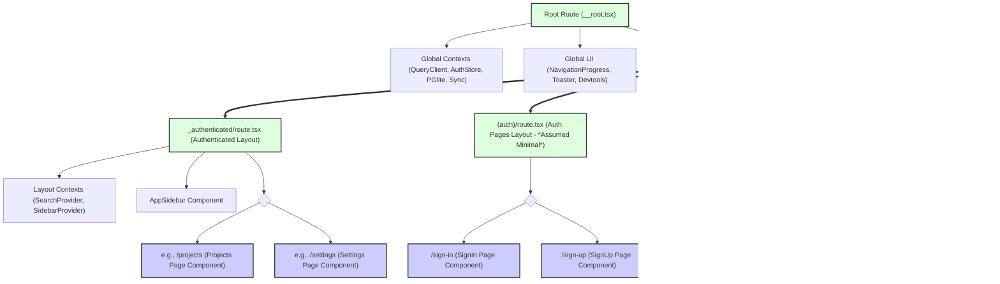

# Frontend Architecture Rules & Guidelines

## 1. Introduction

This document outlines the conventions, rules, and guidelines for the frontend architecture of the web application, focusing on the UI system (Shadcn/ui), routing (TanStack Router), layout structure (including responsiveness and page composition), and styling (Tailwind CSS). Adhering to these guidelines will help maintain consistency, improve collaboration, and ensure the scalability of the frontend codebase.

## 2. UI System (Shadcn/ui)

The project utilizes Shadcn/ui, a collection of re-usable UI components built with Radix UI and Tailwind CSS.

**Key Points:**

*   **Component Location**:
    *   Core Shadcn/ui components (e.g., `Button`, `Card`, `Input`) are located in [`apps/web/src/components/ui/`](apps/web/src/components/ui/). These are typically added via the Shadcn CLI and can be customized as needed.
    *   Custom-built components, often composed of Shadcn/ui primitives or for specific application features, are located in [`apps/web/src/components/`](apps/web/src/components/) (e.g., [`command-menu.tsx`](apps/web/src/components/command-menu.tsx), [`profile-dropdown.tsx`](apps/web/src/components/profile-dropdown.tsx)).
    *   Layout-specific components (e.g., sidebars, headers) are found in [`apps/web/src/components/layout/`](apps/web/src/components/layout/) (e.g., [`app-sidebar.tsx`](apps/web/src/components/layout/app-sidebar.tsx), [`header.tsx`](apps/web/src/components/layout/header.tsx)).
*   **Styling Components**:
    *   Components are styled primarily using Tailwind CSS utility classes.
    *   The `cn` utility function (from [`@/lib/utils`](apps/web/src/lib/utils.ts)) should be used for conditionally applying classes and merging Tailwind classes.
*   **Creating New UI Elements**:
    *   **Prefer Shadcn/ui**: Before creating a new component from scratch, check if a suitable component or primitive exists in Shadcn/ui or Radix UI.
    *   **Composition**: Build complex components by composing simpler Shadcn/ui components.
    *   **Location**: Place new general-purpose custom components in [`apps/web/src/components/`](apps/web/src/components/). If a component is highly specific to a feature, consider co-locating it with that feature's files.
    *   **Accessibility**: Ensure new components are accessible, leveraging Radix UI's accessibility features.

## 3. Routing (TanStack Router)

The application uses TanStack Router for type-safe, file-system-based routing.

**Key Points:**

*   **Configuration**:
    *   Routes are defined by creating files and directories within [`apps/web/src/routes/`](apps/web/src/routes/).
    *   The root of the routing structure is defined in [`apps/web/src/routes/__root.tsx`](apps/web/src/routes/__root.tsx:1). This file sets up global context providers (e.g., `QueryClient`, `AuthStore`, `PGliteContext`, `SyncContext`), handles root-level error components (`notFoundComponent`, `errorComponent`), and manages initial authentication and loading states.
*   **Route Definitions**:
    *   Each route segment typically has a `route.tsx` file (e.g., [`apps/web/src/routes/_authenticated/route.tsx`](apps/web/src/routes/_authenticated/route.tsx:1)) or an `index.tsx` file for the segment's root page.
    *   `createFileRoute` is used to define routes.
*   **Route Groups**:
    *   Parentheses `()` are used to create layout-only route groups that don't affect the URL path (e.g., `(auth)/`, `(errors)/`).
    *   Underscores `_` are used for route groups that share a layout and often a common `beforeLoad` check (e.g., `_authenticated/`).
    *   **`_authenticated/`**: Routes under this group (e.g., [`apps/web/src/routes/_authenticated/projects/index.tsx`](apps/web/src/routes/_authenticated/projects/index.tsx:1)) require user authentication. The `beforeLoad` function in [`apps/web/src/routes/_authenticated/route.tsx`](apps/web/src/routes/_authenticated/route.tsx:10) handles redirection to `/sign-in` if the user is not authenticated.
    *   **`(auth)/`**: Contains authentication-related pages like sign-in ([`apps/web/src/routes/(auth)/sign-in.tsx`](apps/web/src/routes/(auth)/sign-in.tsx:1)), sign-up ([`apps/web/src/routes/(auth)/sign-up.tsx`](apps/web/src/routes/(auth)/sign-up.tsx:1)), etc. These routes typically have a simpler layout, often defined by rendering an `<Outlet />` directly in their respective `route.tsx` if they don't require the main application shell.
    *   **`(errors)/`**: Contains dedicated error pages (e.g., [`404.tsx`](apps/web/src/routes/(errors)/404.tsx:1), [`500.tsx`](apps/web/src/routes/(errors)/500.tsx:1)).
*   **Route Protection**:
    *   Route protection is primarily handled using the `beforeLoad` option in route definitions, as seen in [`apps/web/src/routes/_authenticated/route.tsx`](apps/web/src/routes/_authenticated/route.tsx:11). This function can check authentication status (e.g., via `useAuthStore`) and throw a `redirect` if conditions are not met.
*   **Creating New Routes**:
    *   Create new directories and `route.tsx` or `index.tsx` files within [`apps/web/src/routes/`](apps/web/src/routes/) following the existing file-system conventions.
    *   Utilize appropriate route groups for layout and protection.
    *   Define `loader` functions for data fetching if necessary.

## 4. Layout System

The application employs a hierarchical layout system managed by TanStack Router, designed with responsiveness in mind.

**Key Points:**

*   **Global Layout (`__root.tsx`)**:
    *   Defined in [`apps/web/src/routes/__root.tsx`](apps/web/src/routes/__root.tsx:1).
    *   This is the outermost shell wrapping the entire application.
    *   **Responsibilities**:
        *   Initializes global context providers (React Query, Zustand for auth, PGlite, Sync).
        *   Handles top-level error boundaries (`notFoundComponent`, `errorComponent`).
        *   Manages initial application loading states, displaying an `AuthLoadingSkeleton` (from [`apps/web/src/routes/__root.tsx`](apps/web/src/routes/__root.tsx:17)) or database error messages before the main application or specific route content is ready.
        *   Includes global UI elements like `NavigationProgress` (for route transitions) and `Toaster` (for notifications).
        *   Conditionally renders `TanStackRouterDevtools` in development mode.
    *   It renders an `<Outlet />` where child routes (including different layout groups) will be displayed.

*   **Authenticated Layout (`_authenticated/route.tsx`)**:
    *   Defined in [`apps/web/src/routes/_authenticated/route.tsx`](apps/web/src/routes/_authenticated/route.tsx:35).
    *   Provides the common UI shell for all sections of the application that require user authentication.
    *   **Structure**:
        *   `SearchProvider` and `SidebarProvider`: Contexts for managing search functionality and sidebar state (e.g., collapsed/expanded, default open state from cookies).
        *   `SkipToMain`: An accessibility component.
        *   `AppSidebar`: The main navigation sidebar component (from [`@/components/layout/app-sidebar`](apps/web/src/components/layout/app-sidebar.tsx:1)).
        *   Main Content Area: A `div` with `id='content'` that houses the page-specific content rendered by the nested `<Outlet />`.
    *   **Page Composition within Authenticated Layout**:
        *   Individual pages (e.g., Projects, Settings) are components rendered via the `<Outlet />` within this authenticated layout.
        *   These page components are responsible for their own content and often compose various UI components (from `components/ui` or `components/`) and feature-specific modules.
        *   The page content typically includes a header (often part of the page component itself or a shared layout component if consistent across many pages) and the main body of the page.

*   **Responsive Design**:
    *   The layout is designed to be responsive, primarily leveraging Tailwind CSS's responsive prefixes (e.g., `sm:`, `md:`, `lg:`).
    *   The authenticated layout's main content area dynamically adjusts its width based on the `AppSidebar`'s state (collapsed or expanded), as seen in the conditional classes in [`apps/web/src/routes/_authenticated/route.tsx`](apps/web/src/routes/_authenticated/route.tsx:49-51) (e.g., `peer-data-[state=collapsed]:w-[calc(100%-var(--sidebar-width-icon)-1rem)]`).
    *   The `AuthLoadingSkeleton` in [`apps/web/src/routes/__root.tsx`](apps/web/src/routes/__root.tsx:35) also demonstrates responsive considerations (e.g., `hidden md:flex` for the sidebar skeleton).
    *   Developers should continue to use Tailwind's responsive utilities to ensure new features and components adapt well to different screen sizes.

*   **Layout Components**:
    *   Core layout building blocks like `AppSidebar`, `Header` (if any global header exists, or page-specific headers), `Main` (as a conceptual wrapper for page content) are located in [`apps/web/src/components/layout/`](apps/web/src/components/layout/).

*   **Modifying Layouts**:
    *   For global layout changes affecting all pages (e.g., adding a global banner), modify [`apps/web/src/routes/__root.tsx`](apps/web/src/routes/__root.tsx:1).
    *   For changes specific to the structure of all authenticated pages (e.g., altering sidebar behavior), modify [`apps/web/src/routes/_authenticated/route.tsx`](apps/web/src/routes/_authenticated/route.tsx:1).
    *   For layouts specific to other route groups (e.g., a simpler layout for `(auth)/` pages), create or modify the `route.tsx` file within that group directory.

## 5. Styling (Tailwind CSS)

The project uses Tailwind CSS for utility-first styling.

**Key Points:**

*   **Global Styles**:
    *   Base Tailwind styles (`@tailwind base; @tailwind components; @tailwind utilities;`), custom global styles, and CSS variable definitions (e.g., for theming) are located in [`apps/web/src/index.css`](apps/web/src/index.css:1).
*   **Utility Classes**:
    *   Styling is primarily achieved by applying Tailwind utility classes directly in the JSX of components.
*   **Theming**:
    *   Shadcn/ui theming (colors, border radius, etc.) is configured via CSS variables, defined in [`apps/web/src/index.css`](apps/web/src/index.css:1) (look for `:root` or theme-specific selectors like `.dark`).
*   **Custom CSS**:
    *   Minimize custom CSS. If needed for complex scenarios not easily achievable with Tailwind, add it to [`apps/web/src/index.css`](apps/web/src/index.css:1) or, preferably, use CSS Modules for component-specific styles if Tailwind's `@apply` is insufficient.

## 6. State Management Overview

The application utilizes several state management solutions:

*   **Zustand (`@/stores/authStore`)**: Used for global client-side state, particularly for authentication status, user information, and session lifecycle management ([`apps/web/src/routes/__root.tsx`](apps/web/src/routes/__root.tsx:9)).
*   **TanStack Query (React Query)**: Used for server state management: data fetching, caching, optimistic updates, and synchronization with the server ([`apps/web/src/routes/__root.tsx`](apps/web/src/routes/__root.tsx:1)).
*   **React Context API**:
    *   `PGliteContext` ([`@/db/pglite-provider`](apps/web/src/db/pglite-provider.ts:1)): Manages the PGlite client-side database instance, its initialization state, and any errors.
    *   `SyncContext` ([`@/sync/SyncContext`](apps/web/src/sync/SyncContext.ts:1)): Manages the state of the data synchronization engine (e.g., `syncState`, `lsn`).
    *   `SearchProvider` ([`@/context/search-context`](apps/web/src/context/search-context.ts:1)): Manages search-related state, likely scoped within the authenticated layout.
    *   `SidebarProvider` ([`@/components/ui/sidebar`](apps/web/src/components/ui/sidebar.tsx:1)): Manages the state of the main application sidebar (e.g., expanded/collapsed).

## 7. Diagrams

### Authenticated Layout Component Hierarchy

```mermaid
graph TD
    AuthenticatedRoute["Authenticated Route Component (_authenticated/route.tsx)"] --> SP(SearchProvider)
    SP --> SBP(SidebarProvider)
    SBP --> STM(SkipToMain)
    SBP --> AS[AppSidebar]
    SBP --> MCA{Main Content Area Div (#content)}
    MCA --> OutletContent["Outlet (Page-Specific Content e.g., Projects, Settings)"]
    
    subgraph PageContent [Example: Projects Page]
        OutletContent --> PH[Page Header (Optional, part of page)]
        OutletContent --> PB[Page Body]
        PB --> Comp1[UI Component 1]
        PB --> Comp2[Feature Component X]
    end
```

### High-Level Routing Flow & Layout Structure


---