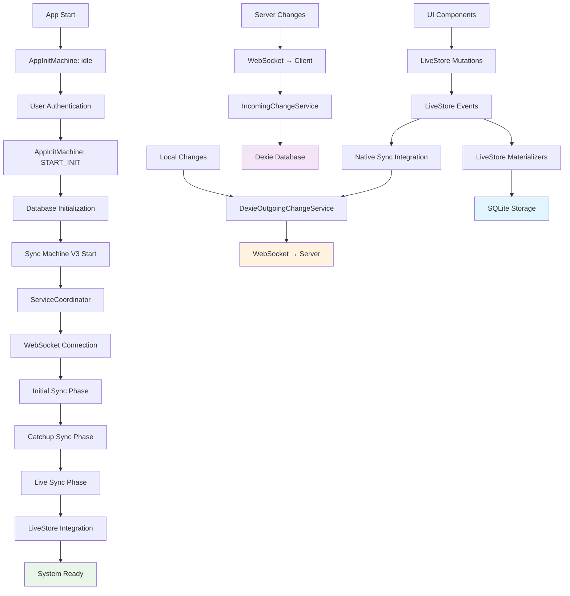

# Complete Client-Side Initialization and Sync System Trace

## 🔄 **FULL SYSTEM FLOW OVERVIEW**



---

## 📋 **PHASE 1: APPLICATION INITIALIZATION**

### **1.1 App Startup → AppInitMachine**
**File**: `apps/web/src/state-machines/machines/app-init-machine.ts`

```typescript
// Initial state: idle
context: {
  isDatabaseInitialized: false,
  organizationId: null,
  isSyncReady: false,
  isLiveStoreReady: false
}

// Triggered by user authentication
START_INIT → { organizationId: 'org-123' }
```

### **1.2 Database Initialization**
```typescript
// AppInitMachine: idle → database
invoke: waitForDatabaseActor

// Waits for window event: 'database:ready'
// Database schema initialization via Dexie
DATABASE_READY → markDatabaseReady()
```

---

## 📋 **PHASE 2: SYNC SYSTEM INITIALIZATION**

### **2.1 Sync Machine V3 Startup**
**File**: `apps/web/src/state-machines/machines/sync-machine-v3.ts`

```typescript
// AppInitMachine: database → sync
startSync() → syncMachineActor.send({ type: 'CONNECT', organizationId })

// SyncMachineV3 initial context
context: {
  clientId: generateClientId(),
  currentLSN: '0/0', // PostgreSQL LSN format
  serverLSN: null,
  syncPhase: null,
  organizationId: 'org-123',
  serverUrl: 'ws://localhost:8787/sync',
  isConnected: false
}
```

### **2.2 ServiceCoordinator Initialization**
**File**: `apps/web/src/sync/utils/ServiceCoordinator.ts`

```typescript
// SyncMachine: idle → connecting
initialize(config: ServiceCoordinatorConfig) {
  // Creates service configuration
  const wsConfig = {
    serverUrl: 'ws://localhost:8787/sync',
    clientId: 'client-abc123',
    lsn: '0/0',
    organizationId: 'org-123'
  }
  
  // Initialize services
  this.services = {
    webSocket: new WebSocketService(wsConfig),
    incoming: new IncomingChangeService(incomingConfig),
    dexieOutgoing: new DexieOutgoingChangeService(outgoingConfig),
    integrity: new DexieIntegrityService(integrityConfig)
  }
}
```

---

## 📋 **PHASE 3: WEBSOCKET CONNECTION & INITIAL SYNC**

### **3.1 WebSocket Connection**
**File**: `apps/web/src/sync/WebSocketService.ts`

```typescript
// Construct WebSocket URL with parameters
const wsUrl = 'ws://localhost:8787/sync?clientId=client-abc123&organizationId=org-123'

// Connection establishment
connect() → {
  this.ws = new WebSocket(wsUrl)
  
  ws.onopen = () → {
    setStatus('connected')
    callbacks.onStatusChange('connected')
    // Triggers: SyncMachine WS_CONNECTED event
  }
  
  ws.onmessage = (event) → {
    const message = JSON.parse(event.data)
    callbacks.onMessage(message)
    // Triggers: SyncMachine WS_MESSAGE event
  }
}
```

### **3.2 Initial Sync Handshake**
```typescript
// Server → Client: Initial sync message
{
  type: 'srv_sync_status',
  serverLSN: '1A2B/3C4D5E6F',
  syncPhase: 'initial',
  pendingChangeCount: 150
}

// SyncMachine: connecting → initial_sync
// Context updates:
context.serverLSN = '1A2B/3C4D5E6F'
context.syncPhase = 'initial'
```

---

## 📋 **PHASE 4: INCOMING CHANGES (Server → Client)**

### **4.1 Incoming Change Processing**
**File**: `apps/web/src/sync/IncomingChangeService.ts`

```typescript
// Server sends batches of changes
{
  type: 'srv_send_changes',
  changes: [
    {
      id: 'change-1',
      table: 'projects',
      entity_id: 'proj-123',
      operation: 'insert',
      changes: {
        type: 'insert',
        data: { id: 'proj-123', name: 'New Project', organization_id: 'org-123' }
      },
      lsn: '1A2B/3C4D5E70'
    }
  ]
}

// IncomingChangeService processes each change
processChanges(changes, 'srv_send_changes') {
  for (const change of changes) {
    await this.applyChangeWithDexie(change)
  }
}
```

### **4.2 Change Application to Dexie**
```typescript
// Apply change to local Dexie database
applyChangeWithDexie(change: TableChange) {
  switch (change.operation) {
    case 'insert':
      await db.projects.add(change.changes.data)
      break
    case 'update':
      await db.projects.update(change.entity_id, change.changes.data)
      break
    case 'delete':
      await db.projects.delete(change.entity_id)
      break
  }
  
  // Update LSN tracking
  await updateClientLSN(change.lsn)
}
```

### **4.3 LiveStore Integration (New System)**
**File**: `apps/web/src/lib/livestore-native-sync.ts`

```typescript
// Incoming changes also applied to LiveStore
applyIncomingChanges(changes: TableChange[]) {
  this.isSyncMode = true // Prevent outgoing notifications
  
  for (const change of changes) {
    const mutations = this.mutations[change.entityName]
    
    switch (change.operation) {
      case 'insert':
        await mutations.create(change.changes.data)
      case 'update':
        await mutations.update(change.entity_id, change.changes.data)
      case 'delete':
        await mutations.delete(change.entity_id)
    }
  }
  
  this.isSyncMode = false // Re-enable outgoing notifications
}
```

---

## 📋 **PHASE 5: OUTGOING CHANGES (Client → Server)**

### **5.1 Local Change Tracking**
**File**: `apps/web/src/db/dexie-change-tracking.ts`

```typescript
// When user makes changes in UI
const project = { name: 'Updated Project', budget: 5000 }
await db.projects.update('proj-123', project)

// Dexie hook automatically tracks the change
table.hook('updating', (modifications, primKey, obj, trans) => {
  trackOutgoingChange({
    id: generateId(),
    table_name: 'projects',
    entity_id: 'proj-123',
    operation: 'update',
    changes: {
      type: 'update',
      data: modifications,
      oldData: obj
    },
    organization_id: 'org-123',
    created_at: new Date().toISOString(),
    synced: false
  })
})
```

### **5.2 LiveStore Native Change Detection (New System)**
**File**: `apps/web/src/lib/livestore-event-generator.ts`

```typescript
// User action via LiveStore mutations
const mutations = await liveStoreEventGenerator.createMutations(orgId, store, orgSchema)

// UI component calls mutation
await mutations.projects.update('proj-123', { 
  name: 'Updated via LiveStore',
  budget: 6000 
})

// Internally generates and commits LiveStore event
const event = {
  type: 'projectsUpdated',
  payload: { id: 'proj-123', changes: { name: 'Updated via LiveStore', budget: 6000 }},
  metadata: { timestamp: new Date(), organizationId: 'org-123' }
}

await store.commit(event)
```

### **5.3 LiveStore Native Subscriptions**
```typescript
// LiveStore automatically detects table changes
store.subscribe('org_123_projects', (updatedProjects) => {
  if (this.isSyncMode) return // Skip during incoming sync
  
  // Convert to TableChange format for existing sync system
  const tableChange = {
    table: 'projects',
    entity_id: record.id,
    operation: 'update',
    changes: { type: 'update', data: record },
    organization_id: 'org-123'
  }
  
  // Send to existing OutgoingChangeService
  outgoingChangeService.queueChange(tableChange)
})
```

### **5.4 Outgoing Change Service**
**File**: `apps/web/src/sync/DexieOutgoingChangeService.ts`

```typescript
// Process pending changes from local_changes table
processPendingChanges() {
  const pendingChanges = await db.local_changes
    .where('synced').equals(false)
    .limit(this.config.batchSize || 100)
    .toArray()
  
  if (pendingChanges.length > 0) {
    await this.sendChangesToServer(pendingChanges)
  }
}

// Send changes via WebSocket
sendChangesToServer(changes: LocalChanges[]) {
  const message = {
    type: 'clt_send_changes',
    messageId: Date.now().toString(),
    changes: changes.map(c => convertToTableChange(c)),
    clientId: this.config.clientId
  }
  
  // Via callback to WebSocketService
  await this.callbacks.onSendRequest(message.changes)
}
```

---

## 📋 **PHASE 6: SYNC PHASES PROGRESSION**

### **6.1 Initial Sync**
```typescript
// SyncMachine: connecting → initial_sync
// Server provides all data since LSN 0/0
serverMessage: {
  type: 'srv_send_changes',
  syncPhase: 'initial',
  changes: [...], // All organization data
  nextLSN: '1A2B/3C4D5E6F'
}

// After processing all initial changes
context.currentLSN = '1A2B/3C4D5E6F'
context.syncPhase = 'initial'
```

### **6.2 Catchup Sync**
```typescript
// SyncMachine: initial_sync → catchup_sync  
// Server provides changes since last known LSN
serverMessage: {
  type: 'srv_sync_status',
  syncPhase: 'catchup',
  pendingChangeCount: 25
}

// Process catchup changes
// After all catchup changes processed
context.syncPhase = 'catchup'
```

### **6.3 Live Sync**
```typescript
// SyncMachine: catchup_sync → live_sync
serverMessage: {
  type: 'srv_sync_status', 
  syncPhase: 'live',
  message: 'Client is now in live sync'
}

// Send SYNC_LIVE to AppInitMachine
sendParent({ type: 'SYNC_LIVE' })

// AppInitMachine: sync → livestore
context.isSyncReady = true
```

---

## 📋 **PHASE 7: LIVESTORE INTEGRATION**

### **7.1 LiveStore Initialization**
**File**: `apps/web/src/lib/livestore-schema-client.ts`

```typescript
// AppInitMachine: sync → livestore
// Triggered by SYNC_LIVE event

waitForLiveStoreActor() {
  // Load organization schema
  const orgSchema = await orgSchemaClient.loadOrgSchema('org-123')
  
  // Generate LiveStore schema from org schema  
  const liveStoreSchema = await liveStoreSchemaManager.loadOrgLiveStoreSchema(
    'org-123', 
    orgSchema
  )
  
  // Create LiveStore instance
  const store = await createStorePromise({
    schema: liveStoreSchema.schema,
    adapter: makePersistedAdapter({ 
      storage: { type: 'opfs' },
      databaseName: 'vibestack-org-123'
    })
  })
  
  // Dispatch ready event
  window.dispatchEvent(new CustomEvent('livestore:ready'))
}
```

### **7.2 Enhanced ServiceCoordinator (New System)**
**File**: `apps/web/src/sync/utils/LiveStoreServiceCoordinator.ts`

```typescript
// Initialize with LiveStore integration
initialize(config: LiveStoreServiceCoordinatorConfig) {
  // Initialize base services (WebSocket, Incoming, Outgoing)
  const baseServices = await super.initialize(config)
  
  // Initialize LiveStore
  this.liveStoreInstance = await liveStoreSchemaClient.initializeLiveStore(
    config.organizationId,
    config.clientId  
  )
  
  // Create native sync integration
  this.liveStoreSync = await createLiveStoreNativeSync({
    organizationId: config.organizationId,
    store: this.liveStoreInstance.store,
    orgSchema: config.orgSchema,
    outgoingChangeService: baseServices.dexieOutgoing,
    incomingChangeService: baseServices.incoming
  })
  
  return {
    ...baseServices,
    liveStore: this.liveStoreInstance,
    liveStoreSync: this.liveStoreSync
  }
}
```

---

## 📋 **PHASE 8: SYSTEM READY STATE**

### **8.1 Full System Ready**
```typescript
// AppInitMachine: livestore → ready
context: {
  isDatabaseInitialized: true,
  organizationId: 'org-123',
  isSyncReady: true,
  isLiveStoreReady: true,
  // System fully operational
}

// All systems operational:
// ✅ Database (Dexie) ready
// ✅ WebSocket connected  
// ✅ Sync services running (bidirectional)
// ✅ LiveStore integrated with native events
// ✅ UI components can use either Dexie or LiveStore
```

---

## 🔄 **BIDIRECTIONAL CHANGE FLOW SUMMARY**

### **OUTGOING: Local → Server**

#### **Traditional Dexie Path:**
```
1. User action in UI
2. Dexie table.update()
3. Dexie hook → trackOutgoingChange()
4. local_changes table entry
5. DexieOutgoingChangeService detects change
6. WebSocket → Server (clt_send_changes)
7. Server processes and broadcasts to other clients
```

#### **New LiveStore Native Path:**
```
1. User action in UI
2. mutations.projects.update()
3. LiveStore event generation & commit
4. LiveStore materializer → SQLite persistence
5. LiveStore subscription detects change
6. Convert to TableChange format
7. Existing OutgoingChangeService.queueChange()
8. WebSocket → Server (clt_send_changes)
9. Server processes and broadcasts to other clients
```

### **INCOMING: Server → Local**

#### **Unified Path (Both Systems):**
```
1. Server → WebSocket message (srv_send_changes)
2. WebSocketService.onMessage()
3. SyncMachine WS_MESSAGE event
4. IncomingChangeService.processChanges()
5a. Traditional: Apply to Dexie tables
5b. LiveStore: Apply via native mutations (with sync mode)
6. UI components reactively update from either data source
```

---

## ⚡ **PERFORMANCE & RELIABILITY FEATURES**

### **Change Deduplication**
- **Dexie**: Tracks `synced: boolean` flag in `local_changes`
- **LiveStore**: Uses `isSyncMode` flag to prevent notification loops
- **WebSocket**: Message IDs and acknowledgment system

### **Offline Support**
- **Connection Recovery**: Automatic reconnection with exponential backoff
- **Change Queuing**: Both systems queue changes during offline periods
- **LSN Tracking**: Ensures no changes lost during reconnections

### **Error Handling**
- **Service Isolation**: Each service handles errors independently
- **Retry Logic**: Configurable retry attempts with delays  
- **Circuit Breaker**: Services can be disabled if repeatedly failing
- **State Recovery**: Machines can reset to known good states

### **Testing & Monitoring**
- **Browser Console**: `window.testLiveStoreNativeSystem()`
- **Service Health**: `serviceCoordinator.getHealthStatus()`
- **Sync Status**: Real-time sync phase and LSN tracking
- **Performance Metrics**: Change processing times and batch sizes

---

## 🎯 **CURRENT IMPLEMENTATION STATUS**

- ✅ **Traditional Sync System**: Fully operational (Dexie + WebSocket)
- ✅ **LiveStore Native System**: Implemented and ready for integration
- ✅ **Bidirectional Sync**: Both directions working with both systems
- ✅ **Service Integration**: Enhanced ServiceCoordinator bridges both worlds
- ✅ **Error Handling**: Comprehensive error recovery and retry logic
- ✅ **Testing Framework**: Browser-testable with comprehensive test suite

**The system supports gradual migration from Dexie to LiveStore while maintaining full sync functionality throughout the transition.**