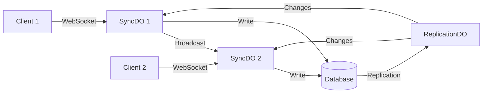

# Implement Sync-Compatible Access Control System

## Overview
Implement a comprehensive access control system that works seamlessly with VibeStack's real-time sync architecture, protecting both WebSocket/SyncDO broadcasts and REST API endpoints while maintaining CRDT consistency and performance.

## Background
VibeStack currently has:
- ✅ **Authentication**: Better Auth v1.2.7 with session management
- ✅ **User Roles**: `admin`, `member`, `viewer`, `super_admin`
- ✅ **User Context in Sync**: User information linked to sync clients via KV storage
- ✅ **WebSocket Sync**: Real-time sync through SyncDO (Durable Objects)

What's missing:
- ❌ **Access Control Filtering**: Users receive all data regardless of permissions
- ❌ **Resource-Level Permissions**: No project/task-specific access control
- ❌ **API Endpoint Protection**: Limited authorization on REST endpoints
- ❌ **Audit Trail**: No tracking of access attempts/denials

## Architecture Overview

### Current Sync Flow


### Proposed Access Control Points
1. **SyncDO Broadcast Level**: Filter changes before sending to other SyncDOs
2. **Initial/Catchup Sync**: Filter historical data based on permissions
3. **API Endpoints**: Validate access before CRUD operations
4. **Client Receipt**: Secondary validation (defense in depth)

## Implementation Plan

## Phase 1: Database Schema & Core Service (Week 1)

### 1.1 Database Schema
```sql
-- Resource-level permissions
CREATE TABLE resource_permissions (
  id UUID PRIMARY KEY DEFAULT gen_random_uuid(),
  user_id UUID NOT NULL REFERENCES users(id) ON DELETE CASCADE,
  resource_type VARCHAR(50) NOT NULL, -- 'project', 'task', 'comment'
  resource_id UUID NOT NULL,
  permission_level VARCHAR(20) NOT NULL, -- 'read', 'write', 'admin'
  granted_by UUID REFERENCES users(id),
  granted_at TIMESTAMP WITH TIME ZONE DEFAULT NOW(),
  expires_at TIMESTAMP WITH TIME ZONE,
  
  UNIQUE(user_id, resource_type, resource_id)
);

-- Indexes for performance
CREATE INDEX idx_user_resources ON resource_permissions(user_id, resource_type);
CREATE INDEX idx_resource_users ON resource_permissions(resource_type, resource_id);

-- Extend project_members with permission levels
ALTER TABLE project_members 
ADD COLUMN permission_level VARCHAR(20) DEFAULT 'write';

-- Audit log for access control
CREATE TABLE access_audit_log (
  id UUID PRIMARY KEY DEFAULT gen_random_uuid(),
  user_id UUID NOT NULL REFERENCES users(id),
  resource_type VARCHAR(50) NOT NULL,
  resource_id UUID NOT NULL,
  action VARCHAR(20) NOT NULL, -- 'granted', 'revoked', 'denied', 'accessed'
  context JSONB, -- Additional context (IP, user-agent, etc.)
  created_at TIMESTAMP WITH TIME ZONE DEFAULT NOW()
);
```

### 1.2 Core Access Control Service
Create `/apps/server/src/services/access-control/AccessControlService.ts`:

```typescript
export interface AccessContext {
  userId: string;
  userRole: string;
  resourceType: string;
  resourceId: string;
  operation: 'read' | 'write' | 'delete' | 'admin';
}

export class AccessControlService {
  private permissionsCache: Map<string, { allowed: boolean; expires: number }> = new Map();
  private readonly CACHE_TTL = 5 * 60 * 1000; // 5 minutes
  
  constructor(
    private neonService: NeonService,
    private auditingEnabled: boolean = true
  ) {}

  /**
   * Main access check method
   */
  async checkAccess(context: AccessContext): Promise<boolean> {
    const cacheKey = `${context.userId}:${context.resourceType}:${context.resourceId}:${context.operation}`;
    
    // Check cache
    const cached = this.permissionsCache.get(cacheKey);
    if (cached && cached.expires > Date.now()) {
      return cached.allowed;
    }

    // Super admin bypass
    if (context.userRole === 'super_admin') {
      this.cachePermission(cacheKey, true);
      return true;
    }

    // Check resource-specific permissions
    const allowed = await this.checkResourcePermission(context);
    
    // Cache result
    this.cachePermission(cacheKey, allowed);
    
    // Audit if enabled
    if (this.auditingEnabled && !allowed) {
      await this.auditAccessDenial(context);
    }
    
    return allowed;
  }

  /**
   * Batch permission check for multiple resources
   */
  async checkBatchAccess(
    userId: string,
    userRole: string,
    resources: Array<{ type: string; id: string; operation: string }>
  ): Promise<Map<string, boolean>> {
    const results = new Map<string, boolean>();
    
    // Group by resource type for optimized queries
    const grouped = this.groupByResourceType(resources);
    
    for (const [resourceType, items] of grouped) {
      const allowedIds = await this.getAccessibleResourceIds(
        userId,
        userRole,
        resourceType,
        items.map(item => item.id)
      );
      
      for (const item of items) {
        results.set(`${resourceType}:${item.id}`, allowedIds.has(item.id));
      }
    }
    
    return results;
  }

  private async checkResourcePermission(context: AccessContext): Promise<boolean> {
    // Implementation specific to each resource type
    switch (context.resourceType) {
      case 'project':
        return this.checkProjectAccess(context);
      case 'task':
        return this.checkTaskAccess(context);
      case 'comment':
        return this.checkCommentAccess(context);
      default:
        // Admin-only for unknown resources
        return context.userRole === 'admin';
    }
  }

  private async checkProjectAccess(context: AccessContext): Promise<boolean> {
    const query = `
      SELECT 1 FROM projects p
      LEFT JOIN project_members pm ON p.id = pm.project_id
      LEFT JOIN resource_permissions rp ON 
        rp.resource_id = p.id AND 
        rp.resource_type = 'project' AND 
        rp.user_id = $1
      WHERE p.id = $2 AND (
        p.owner_id = $1 OR
        pm.user_id = $1 OR
        rp.user_id = $1 OR
        $3 = 'admin'
      )
      LIMIT 1
    `;
    
    const result = await this.neonService.query(query, [
      context.userId,
      context.resourceId,
      context.userRole
    ]);
    
    return result.rows.length > 0;
  }

  // Similar methods for tasks and comments...
}
```

## Phase 2: WebSocket/SyncDO Access Control (Week 2)

### 2.1 Enhanced Broadcast Manager
Update `/apps/server/src/sync/broadcast-manager.ts`:

```typescript
export class BroadcastManager {
  private accessControlService: AccessControlService;
  
  async broadcastChangesToOtherSyncDOs(
    changes: TableChange[], 
    originClientId: string
  ): Promise<void> {
    const activeClients = await this.context.clientRegistryManager.getActiveClients();
    const targetClients = activeClients.filter(id => id !== originClientId);
    
    // Parallel broadcast with access filtering
    const broadcastTasks = targetClients.map(async (targetClientId) => {
      const targetUserContext = await this.getTargetUserContext(targetClientId);
      if (!targetUserContext) return;
      
      // Filter changes based on target user's permissions
      const allowedChanges = await this.filterChangesForUser(
        changes,
        targetUserContext
      );
      
      if (allowedChanges.length > 0) {
        await this.sendChangesToSyncDO(targetClientId, allowedChanges);
        
        syncLogger.info('Access-filtered broadcast', {
          target: targetClientId,
          userId: targetUserContext.userId,
          role: targetUserContext.userRole,
          original: changes.length,
          filtered: allowedChanges.length,
          denied: changes.length - allowedChanges.length
        });
      }
    });
    
    await Promise.allSettled(broadcastTasks);
  }
  
  private async filterChangesForUser(
    changes: TableChange[],
    userContext: UserContext
  ): Promise<TableChange[]> {
    // Batch permission check
    const resources = changes.map(c => ({
      type: c.table,
      id: c.data?.id,
      operation: 'read'
    }));
    
    const permissions = await this.accessControlService.checkBatchAccess(
      userContext.userId,
      userContext.userRole,
      resources
    );
    
    return changes.filter(change => {
      const key = `${change.table}:${change.data?.id}`;
      return permissions.get(key) === true;
    });
  }
}
```

### 2.2 Initial/Catchup Sync Filtering
Update sync to filter based on user permissions:

```typescript
export async function performCatchupSync(
  context: MinimalContext,
  clientId: string,
  clientLSN: string,
  serverLSN: string,
  messageHandler: WebSocketHandler,
  stateManager: SyncStateManager
): Promise<void> {
  const userContext = await stateManager.getUserContext();
  const accessControl = new AccessControlService(new NeonService(context));
  
  // Process changes with access filtering
  const processWithAccess = async (changes: TableChange[]) => {
    if (!userContext) return changes;
    
    const resources = changes.map(c => ({
      type: c.table,
      id: c.data?.id,
      operation: 'read'
    }));
    
    const permissions = await accessControl.checkBatchAccess(
      userContext.userId,
      userContext.userRole,
      resources
    );
    
    return changes.filter(change => {
      const key = `${change.table}:${change.data?.id}`;
      return permissions.get(key) === true;
    });
  };
  
  // Apply filtering to all batches
  // ... rest of implementation
}
```

## Phase 3: API Endpoint Protection (Week 3)

### 3.1 Authorization Middleware
Create `/apps/server/src/middleware/authorization.ts`:

```typescript
export function requireAccess(
  resourceType: string,
  operation: 'read' | 'write' | 'delete' | 'admin'
) {
  return async (c: Context, next: Next) => {
    const user = c.get('user');
    if (!user) {
      return c.json({ error: 'Unauthorized' }, 401);
    }
    
    // Extract resource ID from request
    const resourceId = c.req.param('id') || 
                      (await c.req.json()).id ||
                      c.req.query('id');
    
    if (!resourceId) {
      return c.json({ error: 'Resource ID required' }, 400);
    }
    
    const accessControl = new AccessControlService(c.get('neonService'));
    const hasAccess = await accessControl.checkAccess({
      userId: user.id,
      userRole: user.role,
      resourceType,
      resourceId,
      operation
    });
    
    if (!hasAccess) {
      syncLogger.warn('Access denied', {
        userId: user.id,
        resourceType,
        resourceId,
        operation
      });
      return c.json({ error: 'Forbidden' }, 403);
    }
    
    await next();
  };
}

export function requireRole(roles: string[]) {
  return async (c: Context, next: Next) => {
    const user = c.get('user');
    if (!user || !roles.includes(user.role)) {
      return c.json({ error: 'Insufficient privileges' }, 403);
    }
    await next();
  };
}
```

### 3.2 Protected API Routes
Update API routes with authorization:

```typescript
// Projects API
app.get('/api/projects/:id', 
  requireAuth(),
  requireAccess('project', 'read'),
  async (c) => {
    const project = await repositories.projects.findById(c.req.param('id'));
    return c.json(project);
  }
);

app.put('/api/projects/:id',
  requireAuth(),
  requireAccess('project', 'write'),
  async (c) => {
    const updates = await c.req.json();
    const project = await repositories.projects.update(
      c.req.param('id'),
      updates
    );
    return c.json(project);
  }
);

app.delete('/api/projects/:id',
  requireAuth(),
  requireAccess('project', 'admin'),
  async (c) => {
    await repositories.projects.delete(c.req.param('id'));
    return c.json({ success: true });
  }
);

// Admin-only endpoints
app.get('/api/admin/users',
  requireAuth(),
  requireRole(['admin', 'super_admin']),
  async (c) => {
    const users = await repositories.users.findAll();
    return c.json(users);
  }
);
```

### 3.3 Repository Layer Enhancement
Add access control to repository methods:

```typescript
export class ProjectRepository extends BaseServerRepository<Project> {
  async findAllForUser(userId: string, userRole: string): Promise<Project[]> {
    if (userRole === 'super_admin') {
      return this.findAll();
    }
    
    const query = `
      SELECT DISTINCT p.* FROM projects p
      LEFT JOIN project_members pm ON p.id = pm.project_id
      LEFT JOIN resource_permissions rp ON 
        rp.resource_id = p.id AND 
        rp.resource_type = 'project'
      WHERE 
        p.owner_id = $1 OR 
        pm.user_id = $1 OR 
        rp.user_id = $1 OR
        $2 = 'admin'
    `;
    
    return this.neonService.query(query, [userId, userRole]);
  }
  
  async canUserAccess(
    projectId: string, 
    userId: string, 
    operation: string
  ): Promise<boolean> {
    const accessControl = new AccessControlService(this.neonService);
    return accessControl.checkAccess({
      userId,
      userRole: await this.getUserRole(userId),
      resourceType: 'project',
      resourceId: projectId,
      operation
    });
  }
}
```

## Phase 4: Client-Side Integration (Week 4)

### 4.1 Permission-Aware UI Components
```typescript
// hooks/usePermissions.ts
export function usePermissions() {
  const user = useUser();
  const [permissions, setPermissions] = useState<Map<string, boolean>>(new Map());
  
  const checkPermission = useCallback(async (
    resourceType: string,
    resourceId: string,
    operation: string
  ) => {
    const key = `${resourceType}:${resourceId}:${operation}`;
    if (permissions.has(key)) {
      return permissions.get(key);
    }
    
    // Check with server
    const response = await fetch('/api/permissions/check', {
      method: 'POST',
      body: JSON.stringify({ resourceType, resourceId, operation })
    });
    
    const { allowed } = await response.json();
    setPermissions(prev => new Map(prev).set(key, allowed));
    return allowed;
  }, [permissions]);
  
  return { checkPermission, permissions };
}

// components/ProtectedAction.tsx
export function ProtectedAction({ 
  resourceType, 
  resourceId, 
  operation, 
  children, 
  fallback = null 
}) {
  const { checkPermission } = usePermissions();
  const [allowed, setAllowed] = useState(false);
  
  useEffect(() => {
    checkPermission(resourceType, resourceId, operation)
      .then(setAllowed);
  }, [resourceType, resourceId, operation]);
  
  return allowed ? children : fallback;
}
```

### 4.2 Sync State Validation
```typescript
// Enhanced IncomingChangeService with client-side validation
export class IncomingChangeService {
  async processChanges(
    changes: TableChange[], 
    messageType: string
  ): Promise<ProcessingResult[]> {
    // Secondary validation (defense in depth)
    const validatedChanges = await this.validateUserAccess(changes);
    
    if (validatedChanges.length < changes.length) {
      console.warn('[Security] Received unauthorized changes', {
        received: changes.length,
        validated: validatedChanges.length,
        denied: changes.length - validatedChanges.length
      });
    }
    
    return this.processChangesInternal(validatedChanges, messageType);
  }
  
  private async validateUserAccess(changes: TableChange[]): Promise<TableChange[]> {
    const user = await this.getCurrentUser();
    if (!user) return [];
    
    // Quick client-side validation based on cached permissions
    return changes.filter(change => {
      // Basic validation - server is source of truth
      if (user.role === 'super_admin') return true;
      
      // Check if user should have access to this resource type
      if (change.table === 'users' && user.role !== 'admin') {
        return false;
      }
      
      return true;
    });
  }
}
```

## Phase 5: Testing & Monitoring (Week 5)

### 5.1 Test Suite
```typescript
describe('Access Control System', () => {
  describe('WebSocket Sync', () => {
    test('Users only receive permitted changes via broadcast', async () => {
      // Setup: Create users with different roles
      const adminUser = await createUser({ role: 'admin' });
      const memberUser = await createUser({ role: 'member' });
      const viewerUser = await createUser({ role: 'viewer' });
      
      // Create project accessible only to admin and member
      const project = await createProject({ 
        owner: adminUser,
        members: [memberUser] 
      });
      
      // Connect all users via WebSocket
      const adminWs = await connectWebSocket(adminUser);
      const memberWs = await connectWebSocket(memberUser);
      const viewerWs = await connectWebSocket(viewerUser);
      
      // Make change to project
      await updateProject(project.id, { name: 'Updated' });
      
      // Assert: Admin and member receive update, viewer doesn't
      expect(adminWs.receivedChanges).toContainEqual(
        expect.objectContaining({ table: 'projects', id: project.id })
      );
      expect(memberWs.receivedChanges).toContainEqual(
        expect.objectContaining({ table: 'projects', id: project.id })
      );
      expect(viewerWs.receivedChanges).not.toContainEqual(
        expect.objectContaining({ table: 'projects', id: project.id })
      );
    });
    
    test('Access revocation stops sync updates', async () => {
      // Setup: User with project access
      const user = await createUser({ role: 'member' });
      const project = await createProject({ members: [user] });
      const ws = await connectWebSocket(user);
      
      // Verify initial access
      await updateProject(project.id, { name: 'Update 1' });
      expect(ws.receivedChanges).toHaveLength(1);
      
      // Revoke access
      await removeProjectMember(project.id, user.id);
      
      // Make another change
      await updateProject(project.id, { name: 'Update 2' });
      
      // Assert: User doesn't receive second update
      expect(ws.receivedChanges).toHaveLength(1);
    });
  });
  
  describe('API Endpoints', () => {
    test('Unauthorized access returns 403', async () => {
      const user = await createUser({ role: 'viewer' });
      const project = await createProject({ owner: anotherUser });
      
      const response = await fetch(`/api/projects/${project.id}`, {
        method: 'PUT',
        headers: { Authorization: `Bearer ${user.token}` },
        body: JSON.stringify({ name: 'Hacked' })
      });
      
      expect(response.status).toBe(403);
    });
  });
});
```

### 5.2 Performance Monitoring
```typescript
// Metrics collection for access control
export class AccessControlMetrics {
  private metrics = {
    checksPerformed: 0,
    checksDenied: 0,
    avgCheckTime: 0,
    cacheHitRate: 0,
    broadcastsFiltered: 0,
    changesFiltered: 0
  };
  
  recordCheck(allowed: boolean, duration: number, cacheHit: boolean) {
    this.metrics.checksPerformed++;
    if (!allowed) this.metrics.checksDenied++;
    this.metrics.avgCheckTime = 
      (this.metrics.avgCheckTime * (this.metrics.checksPerformed - 1) + duration) / 
      this.metrics.checksPerformed;
    if (cacheHit) {
      this.metrics.cacheHitRate = 
        (this.metrics.cacheHitRate * (this.metrics.checksPerformed - 1) + 1) / 
        this.metrics.checksPerformed;
    }
  }
  
  async reportMetrics() {
    // Send to monitoring service
    await fetch('/api/metrics', {
      method: 'POST',
      body: JSON.stringify({
        service: 'access_control',
        metrics: this.metrics,
        timestamp: Date.now()
      })
    });
  }
}
```

## Phase 6: Rollout Strategy (Week 6)

### 6.1 Feature Flags
```typescript
export const ACCESS_CONTROL_FLAGS = {
  // Master switch
  ENABLED: process.env.ACCESS_CONTROL_ENABLED === 'true',
  
  // Granular controls
  SYNC_BROADCAST_FILTERING: process.env.AC_SYNC_BROADCAST === 'true',
  SYNC_INITIAL_FILTERING: process.env.AC_SYNC_INITIAL === 'true',
  API_ENDPOINT_PROTECTION: process.env.AC_API_PROTECTION === 'true',
  CLIENT_VALIDATION: process.env.AC_CLIENT_VALIDATION === 'true',
  AUDIT_LOGGING: process.env.AC_AUDIT_LOG === 'true',
  
  // Rollout controls
  ENABLED_FOR_USERS: process.env.AC_USER_LIST?.split(',') || [],
  ENABLED_FOR_PROJECTS: process.env.AC_PROJECT_LIST?.split(',') || [],
  ROLLOUT_PERCENTAGE: parseInt(process.env.AC_ROLLOUT_PCT || '0')
};
```

### 6.2 Gradual Rollout Plan
1. **Week 1**: Deploy infrastructure (schema, services) - no active filtering
2. **Week 2**: Enable audit logging only - monitor access patterns
3. **Week 3**: Enable for internal test projects (5% rollout)
4. **Week 4**: Expand to 25% of projects
5. **Week 5**: Expand to 50% of projects
6. **Week 6**: Full rollout (100%)

### 6.3 Rollback Plan
```typescript
// Emergency rollback capability
export class AccessControlService {
  async checkAccess(context: AccessContext): Promise<boolean> {
    // Emergency bypass
    if (process.env.ACCESS_CONTROL_BYPASS === 'true') {
      console.warn('[EMERGENCY] Access control bypassed', context);
      return true;
    }
    
    // Normal access check
    return this.performAccessCheck(context);
  }
}
```

## Success Metrics

### Performance
- [ ] < 50ms added latency for sync broadcasts
- [ ] < 10ms for cached permission checks
- [ ] > 80% cache hit rate after warmup
- [ ] < 5% increase in database load

### Security
- [ ] 100% of unauthorized access attempts blocked
- [ ] Complete audit trail of access denials
- [ ] No data leakage via sync or API
- [ ] Passes security audit

### User Experience
- [ ] No visible performance degradation
- [ ] Clear error messages for access denials
- [ ] Smooth permission management UI
- [ ] < 1% increase in support tickets

## Migration Checklist

### Pre-Deployment
- [ ] Database migrations tested on staging
- [ ] Performance benchmarks established
- [ ] Rollback procedure tested
- [ ] Monitoring dashboards created
- [ ] Support team trained

### Deployment
- [ ] Deploy database migrations
- [ ] Deploy server code with feature flags OFF
- [ ] Enable audit logging
- [ ] Begin gradual rollout
- [ ] Monitor metrics closely

### Post-Deployment
- [ ] Analyze audit logs for patterns
- [ ] Optimize permission queries based on usage
- [ ] Document common permission scenarios
- [ ] Create permission management UI

## Risk Assessment

### High Risk Items
1. **Performance Impact**: Mitigated by aggressive caching and batch queries
2. **Breaking Changes**: Mitigated by feature flags and gradual rollout
3. **Data Inconsistency**: Mitigated by read-only access checks

### Medium Risk Items
1. **Complexity**: Mitigated by phased implementation
2. **User Confusion**: Mitigated by clear error messages and documentation

## Dependencies
- Better Auth for authentication
- PostgreSQL for permission storage
- KV storage for user context
- Durable Objects for sync

## Team Assignments
- **Backend Lead**: Access control service, database schema
- **Sync Lead**: SyncDO broadcast filtering
- **API Lead**: Endpoint protection
- **Frontend Lead**: Permission-aware UI
- **QA Lead**: Test suite and validation
- **DevOps Lead**: Monitoring and rollout

## Timeline
- **Week 1**: Core infrastructure
- **Week 2**: WebSocket/Sync integration
- **Week 3**: API protection
- **Week 4**: Client integration
- **Week 5**: Testing & monitoring
- **Week 6**: Production rollout

## References
- [Better Auth Documentation](https://www.better-auth.com)
- [Cloudflare Durable Objects](https://developers.cloudflare.com/durable-objects/)
- [PostgreSQL Row-Level Security](https://www.postgresql.org/docs/current/ddl-rowsecurity.html)
- [OWASP Authorization Guidelines](https://owasp.org/www-project-authorization-testing/)