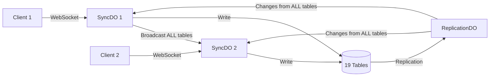

# Implement Comprehensive Sync-Compatible Access Control System

## Overview
Implement a comprehensive access control system that covers **ALL tables** in VibeStack, working seamlessly with the real-time sync architecture, protecting both WebSocket/SyncDO broadcasts and REST API endpoints while maintaining CRDT consistency and performance.

## Background
VibeStack currently has:
- ✅ **Authentication**: Better Auth v1.2.7 with session management
- ✅ **User Roles**: `admin`, `member`, `viewer`, `super_admin`
- ✅ **User Context in Sync**: User information linked to sync clients via KV storage
- ✅ **WebSocket Sync**: Real-time sync through SyncDO (Durable Objects)
- ✅ **19 Database Tables**: Domain entities, system tables, and auth tables

What's missing:
- ❌ **Universal Access Control**: Users receive ALL data from ALL tables regardless of permissions
- ❌ **Project-Based Access Inheritance**: No automatic access control for project-scoped entities
- ❌ **Table-Agnostic Permission System**: No unified system for all current and future tables
- ❌ **Field-Level Privacy**: No filtering of sensitive user fields
- ❌ **Audit Trail**: No tracking of access attempts/denials

## Table Categories & Access Model

### All Tables in VibeStack (19 total)

#### 1. Project-Scoped Tables (9 tables - inherit project access)
```typescript
const PROJECT_SCOPED_TABLES = [
  'tasks',              // Directly belongs to project
  'comments',           // Belongs to task -> project
  'status_sets',        // Project-specific status configurations
  'status_definitions', // Individual statuses within sets
  'tag_sets',          // Project-specific tag groups
  'tags',              // Individual tags within sets
  'entity_dependencies' // Task dependencies and relationships
];
```
**Access Rule**: If user can access the project, they inherit access to ALL these entities within that project.

#### 2. Organization Tables (1 table)
```typescript
const ORG_TABLES = ['projects'];
```
**Access Rule**: Based on ownership, membership, or explicit permissions.

#### 3. User-Scoped Tables (3 tables - personal data)
```typescript
const USER_SCOPED_TABLES = [
  'users',     // User profiles - field-level access control
  'accounts',  // Private auth data - own account only
  'sessions'   // Active sessions - own sessions only
];
```
**Access Rules**:
- `users`: Public fields (name, avatar) visible to all, private fields (email, settings) restricted
- `accounts`/`sessions`: Strictly private - users can only access their own

#### 4. System Tables (9 tables - infrastructure)
```typescript
const SYSTEM_TABLES = [
  'change_history',         // Audit log - admin only
  'sync_metadata',         // Sync tracking - read for debugging
  'client_migration',      // Database migrations
  'client_migration_status', // Migration tracking
  'local_changes',         // Client-side change queue
  'verifications',         // Email/OTP verifications
  'jwks',                  // JWT keys
];
```
**Access Rule**: Admin-only or system-internal, some allow read-only for debugging.

## Architecture Overview

### Current Sync Flow


### Proposed Access Control Points
1. **Universal Table Filter**: Single service that handles ALL 19 tables
2. **Project Access Cache**: Fast lookup for project-scoped entities
3. **Field-Level Filtering**: Remove sensitive fields from user records
4. **Batch Permission Checks**: Optimize for sync performance

## Implementation Plan

## Phase 1: Universal Access Control Service (Week 1)

### 1.1 Database Schema
```sql
-- Universal resource permissions (works for ANY table)
CREATE TABLE resource_permissions (
  id UUID PRIMARY KEY DEFAULT gen_random_uuid(),
  user_id UUID NOT NULL REFERENCES users(id) ON DELETE CASCADE,
  resource_type VARCHAR(50) NOT NULL, -- ANY table name
  resource_id UUID NOT NULL,
  permission_level VARCHAR(20) NOT NULL, -- 'read', 'write', 'admin'
  granted_by UUID REFERENCES users(id),
  granted_at TIMESTAMP WITH TIME ZONE DEFAULT NOW(),
  expires_at TIMESTAMP WITH TIME ZONE,
  
  UNIQUE(user_id, resource_type, resource_id)
);

-- Indexes for performance across all tables
CREATE INDEX idx_user_resources ON resource_permissions(user_id, resource_type);
CREATE INDEX idx_resource_users ON resource_permissions(resource_type, resource_id);

-- Project access cache for fast lookups
CREATE MATERIALIZED VIEW user_project_access AS
SELECT DISTINCT 
  u.id as user_id,
  p.id as project_id,
  CASE 
    WHEN p.owner_id = u.id THEN 'owner'
    WHEN pm.user_id IS NOT NULL THEN 'member'
    WHEN rp.user_id IS NOT NULL THEN 'custom'
  END as access_type
FROM users u
CROSS JOIN projects p
LEFT JOIN project_members pm ON p.id = pm.project_id AND pm.user_id = u.id
LEFT JOIN resource_permissions rp ON rp.resource_id = p.id 
  AND rp.resource_type = 'project' AND rp.user_id = u.id
WHERE p.owner_id = u.id OR pm.user_id IS NOT NULL OR rp.user_id IS NOT NULL;

-- Refresh strategy
CREATE INDEX idx_project_access ON user_project_access(user_id, project_id);
```

### 1.2 Universal Access Control Service
```typescript
export class UniversalAccessControlService {
  // Table categorization for automatic access rules
  private readonly TABLE_CATEGORIES = {
    PROJECT_SCOPED: ['tasks', 'comments', 'status_sets', 'status_definitions', 
                     'tag_sets', 'tags', 'entity_dependencies'],
    USER_SCOPED: ['users', 'accounts', 'sessions'],
    ORG_SCOPED: ['projects'],
    SYSTEM: ['change_history', 'sync_metadata', 'client_migration', 
             'client_migration_status', 'local_changes', 'verifications', 'jwks']
  };

  /**
   * Universal access check for ANY table in the system
   */
  async canAccessEntity(
    userContext: UserContext,
    tableName: string,
    entityId: string,
    operation: 'read' | 'write' | 'delete'
  ): Promise<boolean> {
    // Super admin bypass
    if (userContext.userRole === 'super_admin') return true;

    // Categorize and check
    const category = this.getTableCategory(tableName);
    
    switch (category) {
      case 'SYSTEM':
        return this.checkSystemAccess(userContext, tableName, operation);
      
      case 'USER_SCOPED':
        return this.checkUserScopedAccess(userContext, tableName, entityId, operation);
      
      case 'PROJECT_SCOPED':
        const projectId = await this.getProjectIdForEntity(tableName, entityId);
        return projectId ? this.checkProjectAccess(userContext, projectId, operation) : false;
      
      case 'ORG_SCOPED':
        return this.checkProjectAccess(userContext, entityId, operation);
      
      default:
        // Unknown table - deny by default (secure by default)
        console.warn(`Unknown table ${tableName} - denying access`);
        return false;
    }
  }

  /**
   * Batch permission check for sync operations (ALL tables)
   */
  async filterChangesForUser(
    changes: TableChange[],
    userContext: UserContext
  ): Promise<TableChange[]> {
    // Super admin sees everything
    if (userContext.userRole === 'super_admin') return changes;

    // Group changes by access pattern for efficiency
    const categorized = this.categorizeChanges(changes);
    const allowedChanges: TableChange[] = [];

    // 1. System tables (admin only)
    if (userContext.userRole === 'admin') {
      allowedChanges.push(...categorized.system);
    }

    // 2. User-scoped tables (with field filtering)
    for (const change of categorized.userScoped) {
      const filtered = await this.filterUserScopedChange(change, userContext);
      if (filtered) allowedChanges.push(filtered);
    }

    // 3. Projects (check individual access)
    const projectAccess = await this.getUserProjectAccess(userContext.userId);
    for (const change of categorized.projects) {
      if (projectAccess.has(change.data?.id)) {
        allowedChanges.push(change);
      }
    }

    // 4. Project-scoped entities (batch check by project)
    for (const [projectId, projectChanges] of categorized.projectScoped) {
      if (projectAccess.has(projectId)) {
        allowedChanges.push(...projectChanges);
      }
    }

    return allowedChanges;
  }

  /**
   * Get project ID for ANY project-scoped entity
   */
  private async getProjectIdForEntity(
    tableName: string,
    entityId: string
  ): Promise<string | null> {
    // Dynamic query building based on table relationships
    const query = this.PROJECT_QUERIES[tableName];
    if (!query) return null;
    
    const result = await this.db.query(query, [entityId]);
    return result.rows[0]?.project_id || null;
  }

  // Precompiled queries for each project-scoped table
  private readonly PROJECT_QUERIES = {
    'tasks': 'SELECT project_id FROM tasks WHERE id = $1',
    'comments': `
      SELECT t.project_id FROM comments c
      JOIN tasks t ON c.task_id = t.id WHERE c.id = $1
    `,
    'status_sets': 'SELECT project_id FROM status_sets WHERE id = $1',
    'status_definitions': `
      SELECT ss.project_id FROM status_definitions sd
      JOIN status_sets ss ON sd.status_set_id = ss.id WHERE sd.id = $1
    `,
    'tag_sets': 'SELECT project_id FROM tag_sets WHERE id = $1',
    'tags': `
      SELECT ts.project_id FROM tags t
      JOIN tag_sets ts ON t.tag_set_id = ts.id WHERE t.id = $1
    `,
    'entity_dependencies': `
      SELECT t.project_id FROM entity_dependencies ed
      JOIN tasks t ON ed.source_entity_id = t.id
      WHERE ed.id = $1 AND ed.source_entity_type = 'task'
    `
  };

  /**
   * Filter sensitive fields from user records
   */
  private filterUserFields(userData: any, requesterId: string): any {
    if (userData.id === requesterId) return userData; // Own profile - all fields
    
    // Others see only public fields
    const { password, email, settings, ...publicFields } = userData;
    return publicFields;
  }
}
```

## Phase 2: WebSocket/SyncDO Integration (Week 2)

### 2.1 Enhanced Broadcast Manager
```typescript
export class BroadcastManager {
  private accessControl: UniversalAccessControlService;
  
  async broadcastChangesToOtherSyncDOs(
    changes: TableChange[], 
    originClientId: string
  ): Promise<void> {
    const activeClients = await this.getActiveClients();
    
    // Process all clients in parallel with table-aware filtering
    const broadcasts = activeClients.map(async (targetClientId) => {
      if (targetClientId === originClientId) return; // Skip echo
      
      const targetUser = await this.getUserContext(targetClientId);
      if (!targetUser) return;
      
      // Universal filtering for ALL tables
      const allowed = await this.accessControl.filterChangesForUser(
        changes,
        targetUser
      );
      
      if (allowed.length > 0) {
        await this.sendToSyncDO(targetClientId, allowed);
        
        // Log filtering metrics
        this.metrics.record({
          target: targetClientId,
          original: changes.length,
          allowed: allowed.length,
          tables: [...new Set(changes.map(c => c.table))]
        });
      }
    });
    
    await Promise.allSettled(broadcasts);
  }
}
```

## Phase 3: API Endpoint Protection (Week 3)

### 3.1 Universal Authorization Middleware
```typescript
export function requireTableAccess(operation: 'read' | 'write' | 'delete' | 'admin') {
  return async (c: Context, next: Next) => {
    const user = c.get('user');
    const tableName = c.req.param('table'); // Dynamic table name
    const entityId = c.req.param('id');
    
    const accessControl = new UniversalAccessControlService(c.get('db'));
    const hasAccess = await accessControl.canAccessEntity(
      user,
      tableName,
      entityId,
      operation
    );
    
    if (!hasAccess) {
      return c.json({ 
        error: 'Forbidden',
        table: tableName,
        operation 
      }, 403);
    }
    
    await next();
  };
}

// Universal API routes for ALL tables
app.get('/api/:table/:id', 
  requireAuth(),
  requireTableAccess('read'),
  async (c) => {
    const table = c.req.param('table');
    const repository = repositories.getRepository(table);
    const entity = await repository.findById(c.req.param('id'));
    return c.json(entity);
  }
);
```

## Access Control Matrix (All 19 Tables)

| Table | Category | Viewer | Member | Admin | Access Rule |
|-------|----------|--------|--------|-------|-------------|
| **projects** | Org | Read own | CRUD own | CRUD all | Ownership/membership |
| **tasks** | Project | Via project | Via project | All | Inherits from project |
| **comments** | Project | Via project | Via project | All | Inherits from project |
| **status_sets** | Project | Via project | Via project | All | Inherits from project |
| **status_definitions** | Project | Via project | Via project | All | Inherits from project |
| **tag_sets** | Project | Via project | Via project | All | Inherits from project |
| **tags** | Project | Via project | Via project | All | Inherits from project |
| **entity_dependencies** | Project | Via project | Via project | All | Inherits from project |
| **users** | User | Public fields | Public fields | All fields | Field-level filtering |
| **accounts** | User | Own only | Own only | Read all | Private data |
| **sessions** | User | Own only | Own only | Read all | Security-sensitive |
| **verifications** | System | None | None | Read all | System table |
| **jwks** | System | None | None | Read all | System table |
| **sync_metadata** | System | Read own | Read own | Read all | Debug info |
| **change_history** | System | None | None | Read all | Audit log |
| **client_migration** | System | Read | Read | CRUD | Migrations |
| **client_migration_status** | System | Read own | Read own | Read all | Client state |
| **local_changes** | System | Own only | Own only | None | Client-side |

## Performance Optimizations

### 1. Project Access Cache
```typescript
class ProjectAccessCache {
  private cache = new Map<string, Set<string>>(); // userId -> Set<projectId>
  private ttl = 5 * 60 * 1000; // 5 minutes
  
  async getUserProjects(userId: string): Promise<Set<string>> {
    if (this.cache.has(userId)) {
      return this.cache.get(userId)!;
    }
    
    // Use materialized view for fast lookup
    const projects = await db.query(
      'SELECT project_id FROM user_project_access WHERE user_id = $1',
      [userId]
    );
    
    const projectSet = new Set(projects.rows.map(r => r.project_id));
    this.cache.set(userId, projectSet);
    
    setTimeout(() => this.cache.delete(userId), this.ttl);
    return projectSet;
  }
}
```

### 2. Batch Processing
- Group changes by table category
- Single query per project to check all related entities
- Cache project relationships for 5 minutes
- Use materialized views for complex joins

## Testing Strategy

### Test Coverage for All Tables
```typescript
describe('Universal Access Control', () => {
  // Test each table category
  describe.each(ALL_TABLES)('Table: %s', (tableName) => {
    test(`${tableName}: enforces access control in sync`, async () => {
      // Create test data
      const entity = await createTestEntity(tableName);
      const authorizedUser = await createAuthorizedUser(entity);
      const unauthorizedUser = await createUnauthorizedUser();
      
      // Connect both users
      const authWs = await connectWebSocket(authorizedUser);
      const unauthWs = await connectWebSocket(unauthorizedUser);
      
      // Make change
      await updateEntity(tableName, entity.id, { updated: true });
      
      // Assert
      expect(authWs.receivedChanges).toContainEqual(
        expect.objectContaining({ table: tableName, id: entity.id })
      );
      expect(unauthWs.receivedChanges).not.toContainEqual(
        expect.objectContaining({ table: tableName, id: entity.id })
      );
    });
  });
});
```

## Migration & Rollout

### Phase 1: Deploy Infrastructure (Week 1)
- Deploy universal access control service
- Create resource_permissions table
- Build project access cache

### Phase 2: Enable Monitoring (Week 2)
- Log all access decisions (no blocking)
- Identify access patterns
- Build permission baseline

### Phase 3: Gradual Enforcement (Week 3-4)
- Enable for 10% of users
- Monitor performance impact
- Expand to 50%, then 100%

### Feature Flags
```typescript
const ACCESS_CONTROL = {
  ENABLED: process.env.ACCESS_CONTROL === 'true',
  TABLES: {
    // Granular control per table
    projects: process.env.AC_PROJECTS === 'true',
    tasks: process.env.AC_TASKS === 'true',
    // ... for all 19 tables
  },
  // Gradual rollout
  USER_PERCENTAGE: parseInt(process.env.AC_ROLLOUT_PCT || '0'),
  
  shouldEnforce(userId: string, tableName: string): boolean {
    if (!this.ENABLED) return false;
    if (!this.TABLES[tableName]) return false;
    
    // Hash-based percentage rollout
    const hash = hashUserId(userId);
    return (hash % 100) < this.USER_PERCENTAGE;
  }
};
```

## Success Metrics

### Coverage
- [ ] All 19 tables have access control
- [ ] 100% of sync broadcasts filtered
- [ ] 100% of API endpoints protected

### Performance
- [ ] < 50ms added latency for sync
- [ ] < 10ms for cached permission checks
- [ ] > 80% cache hit rate

### Security
- [ ] Zero unauthorized data in sync
- [ ] Complete audit trail
- [ ] Field-level privacy enforced

## Summary

This universal access control system:
1. **Covers ALL 19 tables** automatically
2. **Uses table categories** to apply consistent rules
3. **Inherits project access** for related entities
4. **Filters at every level**: WebSocket, API, and client
5. **Scales automatically** with new tables

The key innovation is treating access control as a **table-agnostic system** that understands relationships between tables, rather than hardcoding rules for specific entities.