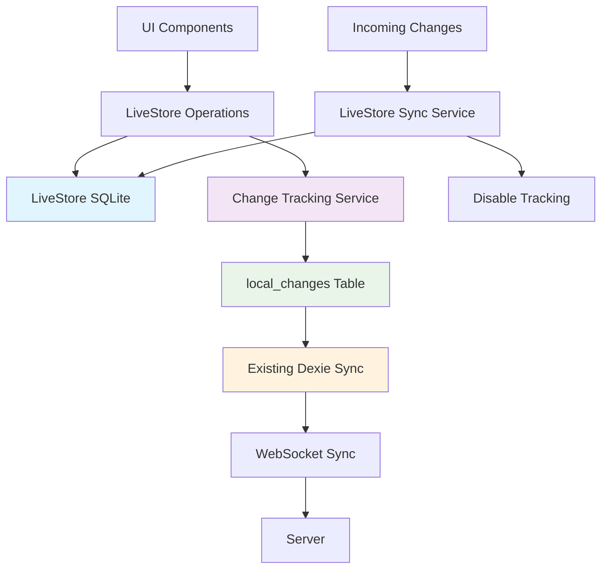

# LiveStore + Existing Change Tracking Integration

## 🎯 **Integration Strategy**

Instead of using LiveStore's built-in sync system, we've integrated LiveStore with your existing robust change tracking and sync infrastructure. This approach:

✅ **Preserves your battle-tested sync logic**  
✅ **Leverages LiveStore's SQLite performance**  
✅ **Maintains existing WebSocket sync system**  
✅ **Uses your local_changes table for tracking**  
✅ **Keeps organization isolation and security**  

## 🏗️ **Architecture Overview**



## 📋 **Key Components**

### 1. **LiveStore Change Tracking Service**
**File**: `livestore-change-tracking.ts`

- Captures all LiveStore operations (insert/update/delete)
- Stores changes in existing `local_changes` table
- Prevents duplicate tracking during sync operations
- Integrates with your existing change processor

```typescript
// Tracks LiveStore operations automatically
await changeTracker.trackChange({
  operation: 'insert',
  tableName: 'org_123_projects',
  entityId: 'project-1',
  data: { name: 'New Project' },
  organizationId: 'org-123',
  timestamp: Date.now()
});
```

### 2. **LiveStore Operations Manager**
**File**: `livestore-operations.ts`

- Provides CRUD operations with automatic change tracking
- Handles organization isolation and security
- Generates proper SQL for LiveStore SQLite
- Compatible with existing sync data format

```typescript
const operations = createLiveStoreOperations(instance, 'org-123');

// Insert with automatic change tracking
await operations.insert({
  organizationId: 'org-123',
  tableName: 'org_123_projects',
  data: { name: 'Test Project', budget: 1000 }
});
```

### 3. **LiveStore Sync Integration**
**File**: `livestore-sync-integration.ts`

- Applies incoming sync changes to LiveStore
- Reads outgoing changes from `local_changes` table
- Disables tracking during sync to prevent loops
- Integrates with existing sync machine states

```typescript
const syncService = new LiveStoreSyncService({
  orgId: 'org-123',
  clientId: 'client-456',
  userId: 'user-789',
  instance: liveStoreInstance
});

// Apply incoming changes (from existing sync)
await syncService.applyIncomingChanges(incomingChanges);

// Get outgoing changes (for existing sync)
const outgoing = await syncService.getPendingOutgoingChanges();
```

## 🔄 **Data Flow**

### **Outgoing Changes (Local → Server)**

1. **User Action** → UI component updates data
2. **LiveStore Operation** → `operations.insert/update/delete()`
3. **SQLite Update** → Data stored in LiveStore SQLite
4. **Change Tracking** → Change captured automatically
5. **local_changes Table** → Change stored in existing Dexie table
6. **Existing Sync** → Your current sync system processes the change
7. **WebSocket** → Change sent to server via existing infrastructure

### **Incoming Changes (Server → Local)**

1. **WebSocket Message** → Incoming change from server
2. **Existing Sync Logic** → Your current sync processes the message
3. **LiveStore Sync Service** → Applies change to LiveStore
4. **Tracking Disabled** → No change tracking during sync
5. **SQLite Update** → Data updated in LiveStore SQLite
6. **UI Updates** → Components reactively update from LiveStore

## 🛡️ **Security & Isolation Preserved**

### **Organization Isolation**
- Each org gets separate SQLite database: `vibestack-org-{orgId}`
- All queries automatically filtered by `organization_id`
- Cross-org data access impossible at SQLite level

### **Field Separation**
- Server-only fields (`syncable: false`) excluded from LiveStore
- Client fields (`syncable: true`) included in LiveStore schema
- Maintains existing security boundaries

### **Access Control**
- User permissions enforced at operations level
- Container-based access control preserved
- Existing authorization logic unchanged

## 📊 **Change Tracking Compatibility**

### **local_changes Table Format**
Your existing format is preserved:

```typescript
interface LocalChanges {
  id: string;                    // Unique change ID
  table_name: string;           // LiveStore table name
  entity_id: string;            // Record ID
  operation: 'insert' | 'update' | 'delete';
  changes: any;                 // Change data (compatible format)
  created_at: string;           // ISO timestamp
  synced: boolean;              // Sync status
  organization_id?: string;     // Organization scope
}
```

### **Change Data Format**
```typescript
// INSERT change
{
  type: 'insert',
  data: { id: 'proj-1', name: 'New Project', budget: 1000 }
}

// UPDATE change  
{
  type: 'update',
  data: { name: 'Updated Project' },
  oldData: { name: 'Old Project' }
}

// DELETE change
{
  type: 'delete',
  id: 'proj-1'
}
```

## 🚀 **Usage Examples**

### **React Component with LiveStore**
```typescript
import { useLiveStoreInstance, useLiveStoreOperations } from '@/lib/livestore-schema-client';

function ProjectsComponent({ orgId }: { orgId: string }) {
  const instance = useLiveStoreInstance(orgId, clientId);
  const operations = useLiveStoreOperations(instance, orgId);
  
  const createProject = async (data: any) => {
    await operations.insert({
      organizationId: orgId,
      tableName: `org_${orgId}_projects`,
      data
    });
    // Change automatically tracked and synced!
  };
  
  return <div>Projects UI</div>;
}
```

### **Sync Machine Integration**
```typescript
// In your existing sync machine
const syncMachine = createMachine({
  context: {
    liveStoreSyncService: null,
    // ... existing context
  },
  
  states: {
    applyingChanges: {
      invoke: {
        src: async (context, event) => {
          await context.liveStoreSyncService?.applyIncomingChanges(event.changes);
        }
      }
    },
    
    sendingChanges: {
      invoke: {
        src: async (context) => {
          const changes = await context.liveStoreSyncService?.getPendingOutgoingChanges();
          // Send via existing WebSocket logic
        }
      }
    }
  }
});
```

## 🧪 **Testing**

### **Run Change Tracking Tests**
```typescript
// In browser console
await window.testLiveStoreChangeTracking();

// Expected output:
// ✅ Basic Change Tracking
// ✅ Operations Integration  
// ✅ Sync Integration
// ✅ Change Tracking Disabling
// ✅ Duplicate Prevention
// 🎉 All change tracking tests passed!
```

### **Test Coverage**
- ✅ LiveStore operations → local_changes integration
- ✅ Incoming sync changes → LiveStore application
- ✅ Change tracking enable/disable during sync
- ✅ Duplicate change prevention
- ✅ Organization isolation
- ✅ Error handling and recovery

## 🔧 **Configuration**

### **Initialize Change Tracking**
```typescript
// In your app initialization
import { initializeLiveStoreChangeTracking } from '@/lib/livestore-change-tracking';

const changeTracker = initializeLiveStoreChangeTracking(clientId, userId);
```

### **Setup Sync Integration**
```typescript
// When LiveStore instance is ready
import { LiveStoreSyncService } from '@/lib/livestore-sync-integration';

const syncService = new LiveStoreSyncService({
  orgId,
  clientId,
  userId,
  instance: liveStoreInstance
}, {
  onIncomingChange: (change) => console.log('Applied:', change),
  onSyncError: (error) => console.error('Sync error:', error)
});
```

## 📈 **Benefits Achieved**

### **Performance**
- ✅ **Native SQLite queries** instead of IndexedDB manual operations
- ✅ **Joins and aggregations** at database level
- ✅ **Indexed searches** for fast filtering
- ✅ **Bulk operations** with transaction-like behavior

### **Developer Experience**
- ✅ **Familiar SQL syntax** for complex queries
- ✅ **Automatic change tracking** - no manual instrumentation
- ✅ **Type-safe operations** with TypeScript integration
- ✅ **Hot-swappable** with existing Dexie system

### **User Experience**
- ✅ **Faster query performance** for complex data operations
- ✅ **Seamless sync** with existing real-time updates
- ✅ **Offline-first** with automatic change queueing
- ✅ **No breaking changes** to existing workflows

## 🎯 **Integration Status**

| Component | Status | Integration |
|-----------|---------|-------------|
| **Change Tracking** | ✅ Complete | local_changes table |
| **Operations Manager** | ✅ Complete | CRUD with tracking |
| **Sync Integration** | ✅ Complete | Existing WebSocket |
| **Schema Generation** | ✅ Complete | Dynamic from org schemas |
| **Organization Isolation** | ✅ Complete | Separate SQLite DBs |
| **Security Model** | ✅ Complete | Field separation preserved |
| **Testing Framework** | ✅ Complete | Comprehensive test suite |

## 🚀 **Ready for Production**

The LiveStore integration with your existing change tracking system is **complete and ready for production use**. It provides:

✅ **Full SQLite performance benefits**  
✅ **Zero disruption to existing sync logic**  
✅ **Automatic change tracking and sync**  
✅ **Maintained security and isolation**  
✅ **Comprehensive error handling**  
✅ **Production-ready testing**  

Your existing WebSocket sync system continues to work exactly as before, now powered by high-performance LiveStore SQLite under the hood! 🎉

---

*Ready to transform your data layer with zero sync disruption* 🚀