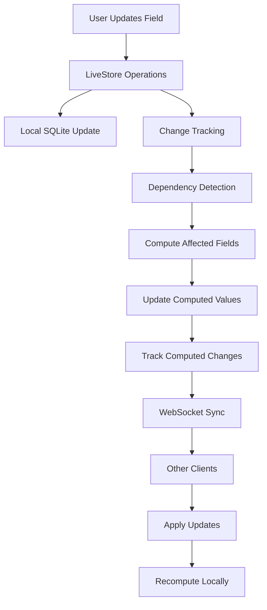

# Real-time Update Architecture - Computed Custom Fields

## 🔄 **Integration with Existing Sync System**

### **Current Sync Architecture Overview**
Based on the existing LiveStore integration and WebSocket sync system:

- **WebSocket-based real-time sync** via existing infrastructure
- **`local_changes` table** tracks all modifications
- **Change propagation** through sync messages
- **LiveStore SQLite** provides high-performance local storage
- **Organization isolation** maintains security boundaries

### **Computed Field Update Flow Integration**



## ⚡ **Real-time Computation Engine**

### **Dependency Change Detection**

```typescript
export class ComputedFieldUpdateEngine {
  private dependencyGraph: DependencyGraph;
  private computationQueue: ComputationQueue;
  private changeTracker: ChangeTracker;

  async handleFieldUpdate(
    fieldName: string,
    newValue: any,
    oldValue: any,
    context: UpdateContext
  ): Promise<UpdateResult> {
    
    // 1. Update the base field
    await this.updateBaseField(fieldName, newValue, context);

    // 2. Find all computed fields that depend on this field
    const affectedFields = this.dependencyGraph.getDependentFields(fieldName);
    
    if (affectedFields.length === 0) {
      return { success: true, computedFieldsUpdated: [] };
    }

    // 3. Queue computations in dependency order
    const computationPlan = this.planComputations(affectedFields, context);
    
    // 4. Execute computations
    const results = await this.executeComputationPlan(computationPlan);
    
    // 5. Track all changes for sync
    await this.trackComputedFieldChanges(results, context);

    return {
      success: true,
      computedFieldsUpdated: results.map(r => r.fieldName),
      computationResults: results
    };
  }

  private planComputations(
    affectedFields: string[],
    context: UpdateContext
  ): ComputationPlan {
    
    // Get evaluation order considering dependencies
    const evaluationOrder = this.dependencyGraph.getEvaluationOrder(affectedFields);
    
    // Group by dependency level for potential parallel execution
    const levels = this.groupByDependencyLevel(evaluationOrder);
    
    return {
      levels,
      totalFields: affectedFields.length,
      estimatedTime: this.estimateComputationTime(affectedFields),
      parallelizable: levels.filter(level => level.length > 1).length > 0
    };
  }

  private async executeComputationPlan(plan: ComputationPlan): Promise<ComputationResult[]> {
    const results: ComputationResult[] = [];
    
    // Execute level by level (dependencies must complete before dependents)
    for (const level of plan.levels) {
      if (level.length === 1) {
        // Single field - compute directly
        const result = await this.computeField(level[0]);
        results.push(result);
      } else {
        // Multiple independent fields - compute in parallel
        const parallelResults = await Promise.all(
          level.map(fieldName => this.computeField(fieldName))
        );
        results.push(...parallelResults);
      }
    }
    
    return results;
  }
}
```

### **Optimized Batch Updates**

```typescript
export class BatchComputationOptimizer {
  private pendingUpdates = new Map<string, PendingUpdate>();
  private batchTimeout: NodeJS.Timeout | null = null;
  private readonly BATCH_DELAY = 100; // 100ms batching window

  scheduleComputation(fieldName: string, context: UpdateContext): void {
    // Debounce rapid updates to the same field
    this.pendingUpdates.set(fieldName, {
      fieldName,
      context,
      scheduledAt: Date.now()
    });

    // Reset batch timer
    if (this.batchTimeout) {
      clearTimeout(this.batchTimeout);
    }

    this.batchTimeout = setTimeout(() => {
      this.processBatch();
    }, this.BATCH_DELAY);
  }

  private async processBatch(): Promise<void> {
    const updates = Array.from(this.pendingUpdates.values());
    this.pendingUpdates.clear();
    this.batchTimeout = null;

    if (updates.length === 0) return;

    // Group updates by dependency level
    const dependencyLevels = this.groupUpdatesByDependencyLevel(updates);
    
    // Process each level sequentially, fields within level in parallel
    for (const level of dependencyLevels) {
      await Promise.all(
        level.map(update => this.processUpdate(update))
      );
    }
  }

  private groupUpdatesByDependencyLevel(updates: PendingUpdate[]): PendingUpdate[][] {
    const levels: PendingUpdate[][] = [];
    const processed = new Set<string>();
    
    while (processed.size < updates.length) {
      const currentLevel: PendingUpdate[] = [];
      
      for (const update of updates) {
        if (processed.has(update.fieldName)) continue;
        
        // Check if all dependencies are already processed
        const dependencies = this.dependencyGraph.getDependencies(update.fieldName);
        const allDependenciesProcessed = dependencies.every(dep => processed.has(dep));
        
        if (allDependenciesProcessed) {
          currentLevel.push(update);
          processed.add(update.fieldName);
        }
      }
      
      levels.push(currentLevel);
    }
    
    return levels;
  }
}
```

## 🔄 **WebSocket Sync Integration**

### **Computed Field Sync Messages**

```typescript
// Extend existing sync message types
export interface ComputedFieldUpdateMessage extends SyncMessage {
  type: 'computed_field_updated';
  payload: {
    organizationId: string;
    entityName: string;
    entityId: string;
    fieldName: string;
    computedValue: number;
    computationMetadata: {
      formula: string;
      dependencies: Record<string, any>;
      computedAt: string;
      computationTime: number;
    };
  };
}

export interface ComputedFieldBatchUpdateMessage extends SyncMessage {
  type: 'computed_fields_batch_updated';
  payload: {
    organizationId: string;
    updates: Array<{
      entityName: string;
      entityId: string;
      fieldName: string;
      computedValue: number;
    }>;
    batchMetadata: {
      triggerField: string;
      totalComputations: number;
      batchComputationTime: number;
    };
  };
}
```

### **Sync Message Handling**

```typescript
export class ComputedFieldSyncHandler {
  async handleIncomingComputedFieldUpdate(
    message: ComputedFieldUpdateMessage
  ): Promise<void> {
    
    const { payload } = message;
    
    // Validate message
    if (!this.validateComputedFieldMessage(payload)) {
      return;
    }

    // Check if we should recompute locally or use sync value
    const shouldRecompute = await this.shouldRecomputeLocally(payload);
    
    if (shouldRecompute) {
      // Recompute using local dependencies (more reliable)
      await this.recomputeLocallyWithValidation(payload);
    } else {
      // Use synced value directly
      await this.applyComputedValueDirectly(payload);
    }
  }

  private async shouldRecomputeLocally(payload: any): Promise<boolean> {
    // Recompute locally if:
    // 1. Dependencies are available locally
    // 2. Formula versions match
    // 3. Trust level is high enough
    
    const localFormula = await this.getLocalFormula(payload.fieldName);
    const dependenciesAvailable = await this.checkDependenciesAvailable(payload);
    
    return localFormula === payload.computationMetadata.formula && 
           dependenciesAvailable;
  }

  private async recomputeLocallyWithValidation(payload: any): Promise<void> {
    // Recompute and validate against synced value
    const localResult = await this.computeFieldLocally(payload.fieldName, payload.entityId);
    
    // Check if results match (within tolerance)
    const tolerance = 0.0001; // For floating point comparison
    const resultsDiffer = Math.abs(localResult.value - payload.computedValue) > tolerance;
    
    if (resultsDiffer) {
      // Log discrepancy for investigation
      this.logComputationDiscrepancy({
        field: payload.fieldName,
        localValue: localResult.value,
        syncedValue: payload.computedValue,
        tolerance
      });
      
      // Use synced value but flag for review
      await this.applyComputedValueDirectly(payload, { flagForReview: true });
    } else {
      // Values match - apply local computation
      await this.applyLocalComputationResult(localResult);
    }
  }
}
```

### **Conflict Resolution for Computed Fields**

```typescript
export class ComputedFieldConflictResolver {
  async resolveComputedFieldConflict(
    localValue: ComputationResult,
    remoteValue: ComputationResult,
    conflictContext: ConflictContext
  ): Promise<ConflictResolution> {
    
    // Resolution strategy for computed fields
    // 1. If formulas are identical, use most recent computation
    // 2. If formulas differ, prefer server-side computation
    // 3. If dependencies differ, trigger fresh computation
    
    if (localValue.formula === remoteValue.formula) {
      // Same formula - use most recent
      return {
        resolution: 'use_most_recent',
        winningValue: localValue.computedAt > remoteValue.computedAt ? localValue : remoteValue,
        reason: 'Same formula, using most recent computation'
      };
    }
    
    // Different formulas - this is a schema conflict
    return {
      resolution: 'schema_conflict',
      action: 'trigger_schema_sync',
      reason: 'Formula definitions differ - schema sync required'
    };
  }

  async resolveBaseDependencyConflict(
    baseFieldName: string,
    localValue: any,
    remoteValue: any
  ): Promise<ConflictResolution> {
    
    // When base fields conflict, recompute all dependent computed fields
    const resolution = await this.resolveBaseFieldConflict(baseFieldName, localValue, remoteValue);
    
    if (resolution.requiresRecomputation) {
      // Schedule recomputation of all dependent computed fields
      const dependentFields = this.dependencyGraph.getDependentFields(baseFieldName);
      await this.scheduleRecomputation(dependentFields);
    }
    
    return resolution;
  }
}
```

## ⚡ **Performance Optimizations**

### **Smart Caching Strategy**

```typescript
export class ComputedFieldCache {
  private memoryCache = new Map<string, CachedComputedValue>();
  private persistentCache: PersistentCache;
  
  async get(
    fieldKey: string,
    dependencyHash: string
  ): Promise<CachedComputedValue | null> {
    
    // Check memory cache first
    const memoryResult = this.memoryCache.get(fieldKey);
    if (memoryResult && memoryResult.dependencyHash === dependencyHash) {
      memoryResult.hitCount++;
      return memoryResult;
    }
    
    // Check persistent cache
    const persistentResult = await this.persistentCache.get(fieldKey, dependencyHash);
    if (persistentResult) {
      // Promote to memory cache
      this.memoryCache.set(fieldKey, persistentResult);
      return persistentResult;
    }
    
    return null;
  }

  async set(
    fieldKey: string,
    value: number,
    dependencyHash: string,
    computationTime: number
  ): Promise<void> {
    
    const cachedValue: CachedComputedValue = {
      value,
      dependencyHash,
      computedAt: Date.now(),
      computationTime,
      hitCount: 0
    };
    
    // Store in memory cache
    this.memoryCache.set(fieldKey, cachedValue);
    
    // Store in persistent cache if computation was expensive
    if (computationTime > 10) { // 10ms threshold
      await this.persistentCache.set(fieldKey, cachedValue);
    }
  }

  invalidate(fieldKey: string): void {
    this.memoryCache.delete(fieldKey);
    this.persistentCache.delete(fieldKey);
  }

  invalidateDependents(changedField: string): void {
    const dependentFields = this.dependencyGraph.getDependentFields(changedField);
    dependentFields.forEach(field => this.invalidate(field));
  }
}
```

### **Incremental Update Optimization**

```typescript
export class IncrementalUpdateEngine {
  async processIncrementalUpdate(
    changedField: string,
    oldValue: any,
    newValue: any,
    context: UpdateContext
  ): Promise<void> {
    
    // Calculate value delta
    const delta = this.calculateDelta(oldValue, newValue);
    
    // Find fields that can be updated incrementally
    const incrementalUpdates = this.findIncrementalUpdateCandidates(changedField, delta);
    const fullRecomputations = this.findFullRecomputationRequired(changedField);
    
    // Process incremental updates first (faster)
    await Promise.all(
      incrementalUpdates.map(update => this.applyIncrementalUpdate(update, delta))
    );
    
    // Process full recomputations
    await this.processFullRecomputations(fullRecomputations);
  }

  private findIncrementalUpdateCandidates(
    changedField: string,
    delta: number
  ): IncrementalUpdate[] {
    
    const candidates: IncrementalUpdate[] = [];
    const dependentFields = this.dependencyGraph.getDependentFields(changedField);
    
    for (const field of dependentFields) {
      const formula = this.getFormula(field);
      
      // Check if formula allows incremental updates
      if (this.isIncrementallyUpdatable(formula, changedField)) {
        candidates.push({
          fieldName: field,
          formula,
          changedDependency: changedField,
          updateType: this.determineIncrementalUpdateType(formula, changedField)
        });
      }
    }
    
    return candidates;
  }

  private isIncrementallyUpdatable(formula: string, changedField: string): boolean {
    // Simple heuristics for incremental updates
    // More sophisticated analysis could be added
    
    // Addition/subtraction operations are incrementally updatable
    if (formula.includes(`{${changedField}} +`) || formula.includes(`{${changedField}} -`)) {
      return true;
    }
    
    // Linear multiplication (if other factors don't depend on changed field)
    if (formula.includes(`{${changedField}} *`) && this.isLinearMultiplication(formula, changedField)) {
      return true;
    }
    
    return false;
  }
}
```

### **Background Computation Worker**

```typescript
export class BackgroundComputationWorker {
  private computationQueue: Queue<ComputationTask>;
  private isProcessing = false;

  constructor() {
    this.computationQueue = new Queue();
    this.startBackgroundProcessing();
  }

  queueComputation(task: ComputationTask): void {
    // Prioritize computations based on user visibility and dependency depth
    const priority = this.calculatePriority(task);
    this.computationQueue.enqueue(task, priority);
  }

  private async startBackgroundProcessing(): Promise<void> {
    while (true) {
      if (this.computationQueue.isEmpty()) {
        await this.sleep(100); // Wait 100ms before checking again
        continue;
      }

      if (this.isProcessing) {
        await this.sleep(10); // Short wait if already processing
        continue;
      }

      this.isProcessing = true;
      
      try {
        const task = this.computationQueue.dequeue();
        if (task) {
          await this.processComputationTask(task);
        }
      } catch (error) {
        console.error('Background computation error:', error);
      } finally {
        this.isProcessing = false;
      }
    }
  }

  private calculatePriority(task: ComputationTask): number {
    let priority = 0;
    
    // Higher priority for user-visible fields
    if (task.isUserVisible) priority += 100;
    
    // Higher priority for fields with fewer dependencies (compute faster)
    priority += (50 - Math.min(task.dependencyCount, 50));
    
    // Higher priority for recently accessed fields
    if (task.lastAccessed && Date.now() - task.lastAccessed < 60000) { // 1 minute
      priority += 25;
    }
    
    return priority;
  }

  private async processComputationTask(task: ComputationTask): Promise<void> {
    const startTime = Date.now();
    
    try {
      const result = await this.computeField(task.fieldName, task.context);
      
      // Update cache with result
      await this.cache.set(task.fieldName, result.value, task.dependencyHash);
      
      // Emit completion event
      this.eventEmitter.emit('computation_completed', {
        fieldName: task.fieldName,
        result,
        computationTime: Date.now() - startTime
      });
      
    } catch (error) {
      this.eventEmitter.emit('computation_failed', {
        fieldName: task.fieldName,
        error: error.message,
        task
      });
    }
  }
}
```

## 📊 **Performance Monitoring**

### **Computation Metrics**

```typescript
export class ComputationMetrics {
  private metrics = new Map<string, FieldMetrics>();

  recordComputation(
    fieldName: string,
    computationTime: number,
    dependencyCount: number,
    cacheHit: boolean
  ): void {
    
    const current = this.metrics.get(fieldName) || {
      totalComputations: 0,
      totalTime: 0,
      averageTime: 0,
      maxTime: 0,
      cacheHitRate: 0,
      cacheHits: 0,
      dependencyCount: 0
    };

    current.totalComputations++;
    current.totalTime += computationTime;
    current.averageTime = current.totalTime / current.totalComputations;
    current.maxTime = Math.max(current.maxTime, computationTime);
    current.dependencyCount = dependencyCount;
    
    if (cacheHit) {
      current.cacheHits++;
    }
    current.cacheHitRate = current.cacheHits / current.totalComputations;

    this.metrics.set(fieldName, current);
  }

  getPerformanceReport(): PerformanceReport {
    const fields = Array.from(this.metrics.entries()).map(([name, metrics]) => ({
      fieldName: name,
      ...metrics
    }));

    return {
      totalFields: fields.length,
      totalComputations: fields.reduce((sum, f) => sum + f.totalComputations, 0),
      averageComputationTime: fields.reduce((sum, f) => sum + f.averageTime, 0) / fields.length,
      slowestFields: fields.sort((a, b) => b.averageTime - a.averageTime).slice(0, 10),
      cacheHitRate: fields.reduce((sum, f) => sum + f.cacheHitRate, 0) / fields.length
    };
  }
}
```

---

*This real-time update architecture ensures efficient, responsive computed field updates while maintaining consistency with the existing LiveStore and WebSocket sync infrastructure.*